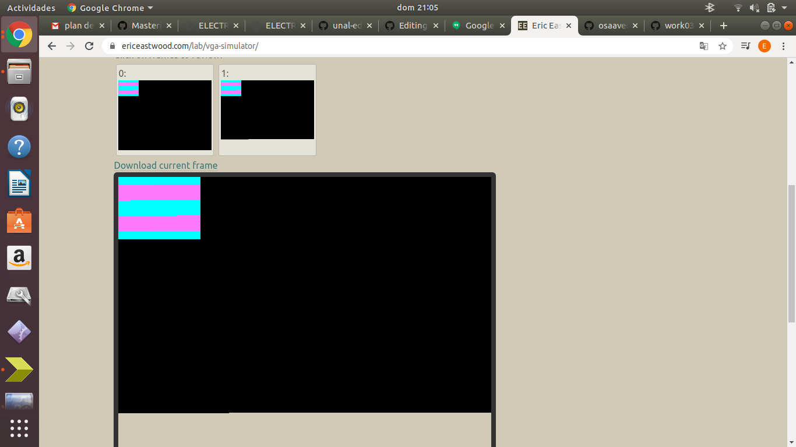
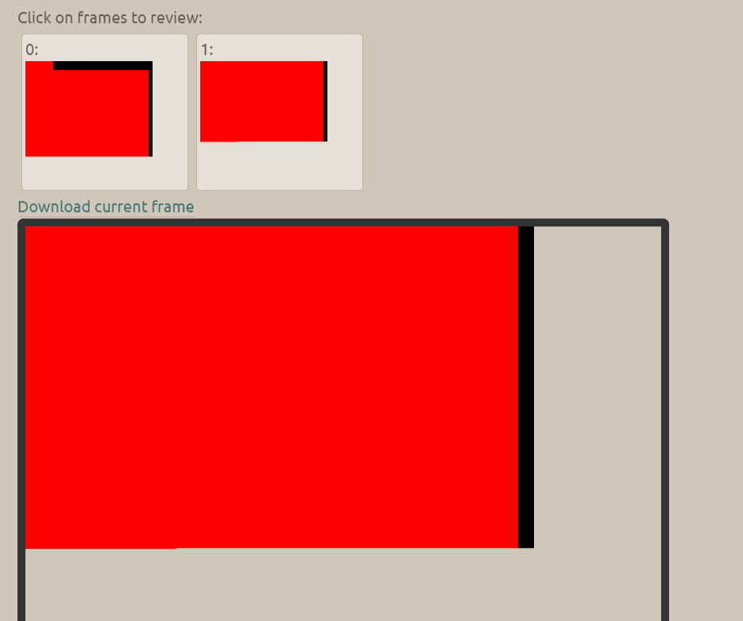
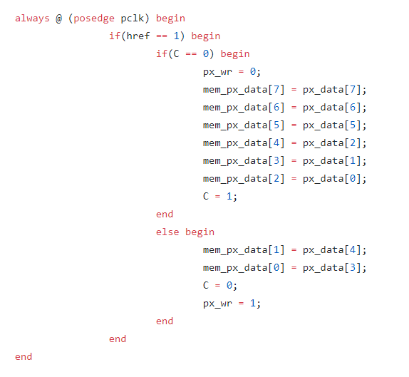
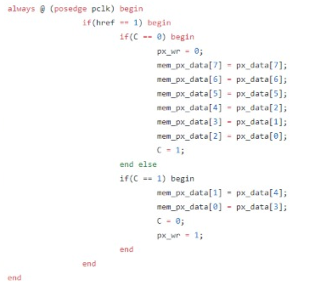

## Modulo Cam_read
### Ericson Brayan Mesa Orjuela

### Oscar Mauricio Saavedra Gonzalez

### Sergio Andres Gerena Gomez

En este trabajo se buscaba integrar un nuevo modulo basado en el modulo de captura de datos realizado en la anterior vez, para ello se alteraron los nombres de las variables y verifico el funcionamiento del mismo con un simulador de VGA, a continuacion se muestra los resultados de  esto y las diversas dificultades presentadas a lo largo de este desarrollo.

Primeramente se clono el repositorio y provo la creacion del archivo a simular sin alterar el codigo presentado, en esta etapa mostramos la simulacion del VGA a continuación:

La siguiente parte fue integrar el modulo de captura de camara desarrollado en el taller al paquete y volver a simular el mismo, el modulo el resultado de esto se muestra a continuacion:

Como evidenciamos perfectamente en la imagen, en la primera prueba el modulo de captura mostro estar mal, ya que no arrojaba la figura que en teoria debia mostrar, vemos como pinta los dos frames de color rojo completamente. Al revisar el codigo de la captura de datos, encontramos la siguiente seccion:

Aca podemos apreciar existe un error de sintaxis en el primer ciclo, al cerrar este antesde que pudiera entrar en la consicion del else, por consiguiente resulta que jamas actualiza realmente una posicion de memoria ni lleva la convercion de manera adecuda, por lo que siempre manda la informacion del rojo en toda la simulacion, luego de corregir el error presentado, se llego al siguiente codigo:

